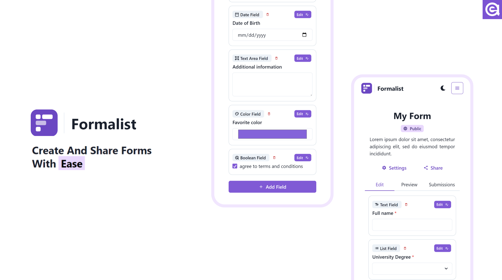

# Formalist

Formalist is an interactive form builder made by React, Nextjs, Typescript and MongoDB.

Notable features:

- 9 different fields such as **Text**,**List Field**, **Date-Time**, **Color** and more.
- Accessible and **ARIA compliant** with a fully **responsive**, mobile first design.
- Easily **Share** forms with just a link.
- Ability to make submissions **public** such that anyone visiting form's link can see other people's submissions.
- Publicly visible submissions are **server side rendered** for **SEO** and search engine visibility.
- Built on top of **JSON schema** standards, such that with just one schema, the form is verifiable both on the client side and server side.

## ToDo

- Auth: this project is still in demo phase and implementing authentication would have gotten in the way of demo-ing process, later on I will be releasing two versions of the website, one fully functional with auth and another one without auth for the demo.

This was the largest -and at times most painful- react project that i have ever done all by myself. However i do think things i learned well worthed the pain as it made me more familiar with Typescript, Nextjs and component lifecycles. I will appreciate your input whether here on my Github or through my email: emamiarian8@gmail.com
